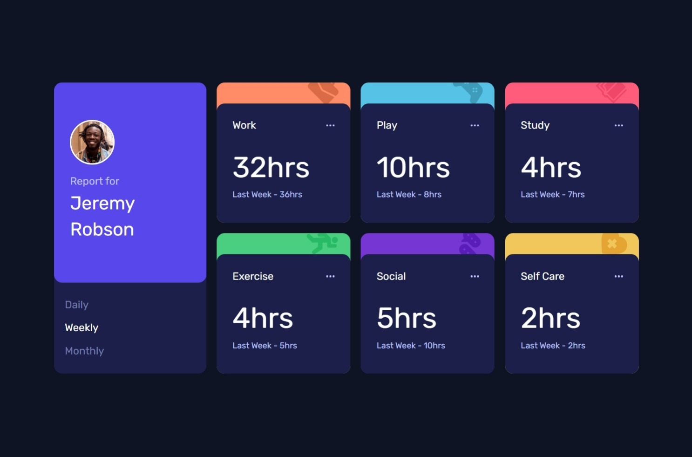
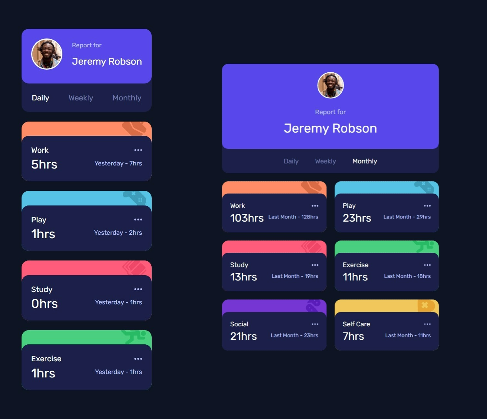

# Frontend Mentor - Time tracking dashboard solution

This is a solution to the [Time tracking dashboard challenge on Frontend Mentor](https://www.frontendmentor.io/challenges/time-tracking-dashboard-UIQ7167Jw). Frontend Mentor challenges help you improve your coding skills by building realistic projects.

## Table of contents

- [Overview](#overview)
  - [The challenge](#the-challenge)
  - [Screenshot](#screenshot)
  - [Links](#links)
- [My process](#my-process)
  - [Built with](#built-with)
  - [What I learned](#what-i-learned)
  - [Continued development](#continued-development)
  - [Useful resources](#useful-resources)
- [Author](#author)

## Overview

### The challenge

Users should be able to:

- View the optimal layout for the site depending on their device's screen size
- See hover states for all interactive elements on the page
- Switch between viewing Daily, Weekly, and Monthly stats

### Screenshot



##



### Links

- Solution URL: [Challenge Solution](https://www.frontendmentor.io/solutions/time-tracking-dashboard-solution-using-async-js-json-and-dom-aPiGX60ILO)
- Live Site URL: [Live Preview](https://ayman-soliman-1783.github.io/time-tracking-dashboard/)

## My process

### Built with

- Semantic HTML5 markup
- CSS custom properties
- Mobile-first workflow
- Flexbox
- CSS Grid
- JavaScript
- JS DOM Manipulation
- Asynchronous JavaScript

### What I learned

I learned that asynchronous JavaScript allows me to fetch data from a server without blocking the main thread, ensuring a smooth user experience. I used ```fetch("data.json")``` to retrieve data asynchronously and ```await response.json()``` to convert it into a JavaScript object. I also learned how to handle potential errors using ```try...catch``` to prevent crashes.
For object and data manipulation, I learned how to use ```find()``` to search for a specific object in an array and optional chaining (```?.```) to safely access nested properties without errors. Additionally, I used template literals (```${}```) to dynamically update the UI based on fetched data. These techniques helped me efficiently work with structured data and interact with the DOM seamlessly.

```html
<div class="time">
  <span class="hours"></span>
  <span class="previous-hours"></span>
</div>
```

```js
const timeTrackingOptions = document.querySelectorAll("#time-tracking-options .option");
const timeTrackers = document.querySelectorAll(".time-tracker");


// Attach event listeners to tracking options
timeTrackingOptions.forEach((option) => {
  option.addEventListener("click", async () => {
    optionType = option.getAttribute("data-option");
    await updateTimeTrackers(optionType);
  });
});

// Fetch and update all time tracker elements
async function updateTimeTrackers(optionType) {
  try {
    const response = await fetch("data.json");
    const data = await response.json();

    timeTrackers.forEach((tracker) => {
      const category = tracker.getAttribute("data-category");
      const categoryData = data.find((item) => item.title === category);
      
      const currentHours =
        categoryData.timeframes?.[optionType]?.current || 0;
      const previousHours =
        categoryData.timeframes?.[optionType]?.previous || 0;
    });
  } catch (error) {
    console.error("Error fetching time tracking data:", error);
  }
}
```

### Continued development

I want to continue improving my understanding of asynchronous JavaScript, particularly in handling multiple asynchronous operations efficiently using ```Promise.all()``` and ```async```/```await``` in more complex scenarios. Additionally, I aim to refine my error-handling skills to make my code more resilient.
For object and data manipulation, I want to deepen my knowledge of working with nested objects, optimizing data structures, and improving performance when handling large datasets. I also plan to practice using advanced array methods like ```map()```, ```reduce()```, and ```filter()``` to write more efficient and readable code.
Finally, I want to focus on best practices in DOM manipulation, ensuring I write scalable, maintainable code that minimizes unnecessary re-renders and improves overall performance.

### Useful resources

- [Elzero Web School](https://elzero.org/) - This is an amazing Egyptian web academy that helped me finally understand asynchronous JavaScript and object manipulation. I'd recommend it to anyone still learning these concepts.

## Author

- Website - [Ayman Soliman](https://bento.me/ayman-soliman)
- Frontend Mentor - [@ayman-soliman-1783](https://www.frontendmentor.io/profile/ayman-soliman-1783)
- Twitter - [@a_soliman1783](https://x.com/a_soliman1783)
